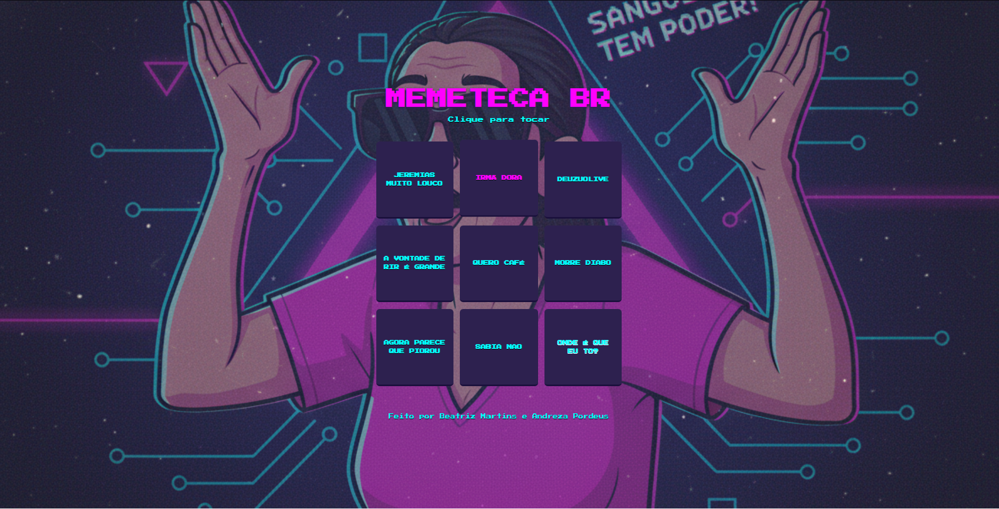

# 🎵 Memeteca BR



**O Soundboard Definitivo de Memes Brasileiros!** 🎉

## 📖 Sobre o Projeto

A **Memeteca BR** é um soundboard interativo que permite aos usuários reproduzir os sons dos memes mais icônicos e clássicos do Brasil. Uma experiência nostálgica e divertida que resgata os áudios que marcaram a cultura digital brasileira.

## ✨ Funcionalidades

- 🎵 **9 Sons Clássicos**: Jeremias Muito Louco, Irmã Dora, Deuzuolive, A Vontade de Rir, Quero Café, Morre Diabo, Parece que Piorou, Sabia Não e Onde é que eu tô?
- 🖱️ **Interação por Clique**: Clique nos botões para reproduzir os sons
- ⌨️ **Suporte ao Teclado**: Use as teclas Enter ou Espaço para ativar os botões
- 🎨 **Interface Responsiva**: Design adaptado para diferentes tamanhos de tela
- 🔄 **Reprodução Única**: Para o som anterior quando um novo é reproduzido
- ♿ **Acessibilidade**: Inclui atributos ARIA para melhor experiência com leitores de tela

## 🛠️ Tecnologias Utilizadas

- **HTML5**: Estrutura semântica e elementos de áudio
- **CSS3**: Estilização com Tailwind CSS e animações
- **JavaScript (ES6+)**: Lógica de interação e manipulação do DOM
- **Tailwind CSS**: Framework CSS para design responsivo
- **Google Fonts**: Tipografia "Press Start 2P" para estética retro

## 🎨 Design e UX

- **Tema Retro**: Inspirado em interfaces de jogos clássicos
- **Cores Vibrantes**: Paleta com magenta, ciano e roxo
- **Animações Suaves**: Efeitos de hover e transições
- **Layout em Grid**: Organização em grade 3x3 dos botões
- **Responsividade**: Adaptação para mobile e desktop

## 🚀 Como Executar

1. Clone o repositório:
```bash
git clone https://github.com/seu-usuario/memeteca-nacional.git
```

2. Navegue até o diretório:
```bash
cd memeteca-nacional
```

3. Abra o arquivo `index.html` em seu navegador ou use um servidor local:
```bash
# Usando Python
python -m http.server 8000

# Usando Node.js (http-server)
npx http-server

# Usando Live Server (VS Code)
# Instale a extensão Live Server e clique com botão direito no index.html
```

## 📁 Estrutura do Projeto

```
memeteca-nacional/
├── assets/
│   ├── audio/          # Arquivos de áudio dos memes
│   └── image/          # Imagens e ícones
├── dist/               # CSS compilado (Tailwind)
├── src/
│   ├── input.css       # CSS source com Tailwind
│   ├── output.css      # CSS compilado
│   └── script.js       # JavaScript principal
├── index.html          # Página principal
├── package.json        # Dependências do projeto
└── readme.md          # Este arquivo
```

## 🎵 Memes Incluídos

| Meme | Arquivo de Áudio | Descrição |
|------|------------------|-----------|
| Jeremias Muito Louco | `matava-mil.mp3` | "Matava mil, matava mil..." |
| Irmã Dora | `sangue-de-jesus.MP3` | "Sangue de Jesus tem poder!" |
| Deuzuolive | `deuzolive.mp3` | Clássico do humor brasileiro |
| A Vontade de Rir | `audios_a-vontade-de-rir.mp3` | "A vontade de rir é grande" |
| Quero Café | `quero-cafe.mp3` | "Quero café, quero café..." |
| Morre Diabo | `morre-diabo.mp3` | "Morre diabo, morre diabo!" |
| Parece que Piorou | `parece-que-piorou.MP3` | "Agora parece que piorou" |
| Sabia Não | `que-merda-hein.mp3` | "Sabia não, que merda hein!" |
| Onde é que eu tô? | `onde-e-que-to.mp3` | "Onde é que eu tô?" |

## 🎓 Origem do Projeto

Este projeto foi desenvolvido como parte do curso **"JavaScript para Web: Crie páginas dinâmicas"** da [Alura](https://www.alura.com.br/), onde aprendemos a:

- Manipular o DOM com JavaScript
- Criar interações dinâmicas
- Trabalhar com elementos de áudio
- Implementar acessibilidade
- Desenvolver interfaces responsivas

## 🖼️ Assets e Imagens

As imagens e assets visuais foram gerados utilizando o **Gemini AI**, garantindo uma identidade visual única e moderna para o projeto.

## 👥 Contribuição

Contribuições são bem-vindas! Sinta-se à vontade para:

- Adicionar novos memes
- Melhorar a acessibilidade
- Otimizar o código
- Sugerir melhorias na UX

## 📄 Licença

Este projeto está sob a licença MIT. Veja o arquivo `LICENSE` para mais detalhes.

## 🙏 Agradecimentos

- **Alura** pelo excelente curso de JavaScript
- **Gemini AI** pela geração das imagens
- **Comunidade Brasileira de Memes** pela inspiração
- **Tailwind CSS** pelo framework de estilização

---

**Feito com ❤️ por Beatriz Martins e Andreza Pordeus**

*Divirta-se explorando os memes mais clássicos do Brasil!* 🇧🇷
